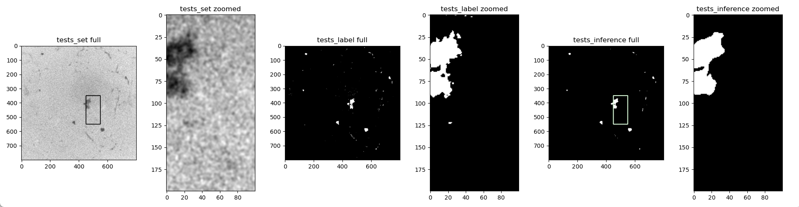

# 摘要

API 囊括的范畴包括
+ 一整套读写土柱并自动分割的函数
+ 评价用的函数，例如Dice系数，IOU和MIOU
+ 可视化的图像比较，放大比较的工具
+ 多张图片裁切、然后拼合的工具，用来组成土柱纵剖面图
+ Unet简单代码

# 代码仓库结构

主要的API函数放在API_functions文件夹中，其中很多函数不过是很小的调库操作，其根本目的在于简化操作，尤其是以防太多的库函数只用那么几次真的记不住。

主要文档放在doc中，其中有一部分是一些简单的操作，可以理解为一个demo。

剩余的，wandb是一个记录训练过程的log文件，data是用来简单分割的一些图片。

# Others

最正确的逻辑，应该是column_batch中的函数，其输入输出特性都可以在正常的情况下被使用，比如临时我有一百张图片想截个ROI这样。
新的api改成两条线，一条正常的函数，可以被通用。另一条所有函数归在SoilColumn类下，仅能在这里被调用，并且在这里调用逻辑则更简单，输入输出更简单。

# To_do list

- [ ] add id to column class

# file_batch

+ get_list
    + show_image_names
    + get_image_names
+ read_all_into_rom
    + read_images
    + output_images
+ read_one_by_one
    + column_batch_related
        + roi_select
        + rename
        + image_process
    + transformer
        + format_transformer
        + convert_to_binary
        + binary_to_grayscale

# Column_Analysis

+ get_left_right_surface
+ get_porosity_curve
+ draw_porosity_curve
+ dying_color_optimized
+ create_nifti

# Some tools

## `tools`

有一个小工具，可以用来读取n个文件夹，其中所有的图片文件应该具备相同的文件名，因此可以创建一个数据库，每一个文件对象都同时具备多个样子，例如test数据集中的图片1，test_inference数据集中的，test_label中的数据集的。

## `tools_read_raw`

可以用来读取raw文件，其中用到了

    
